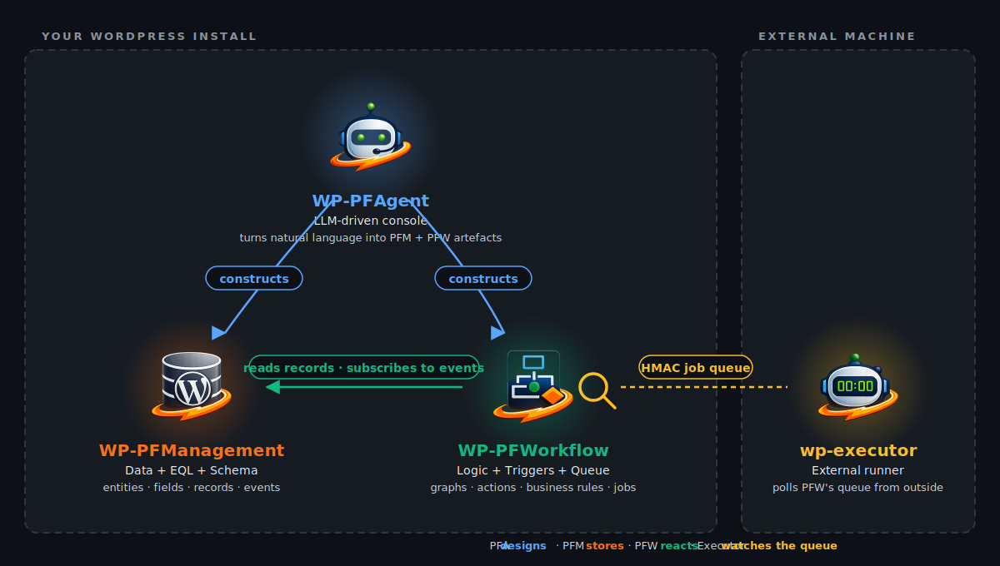
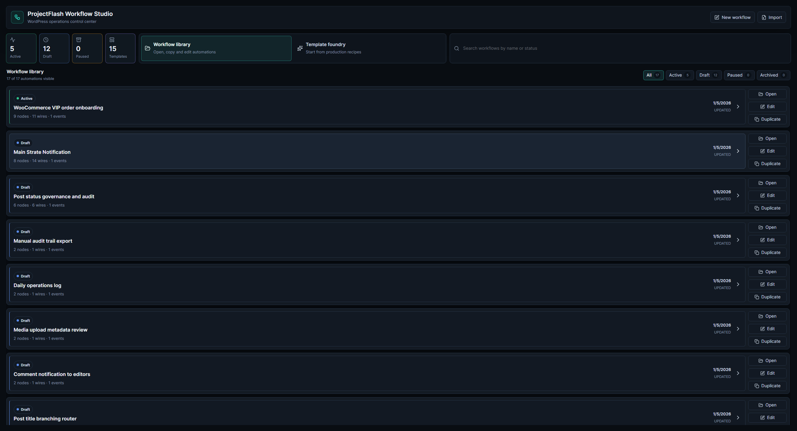
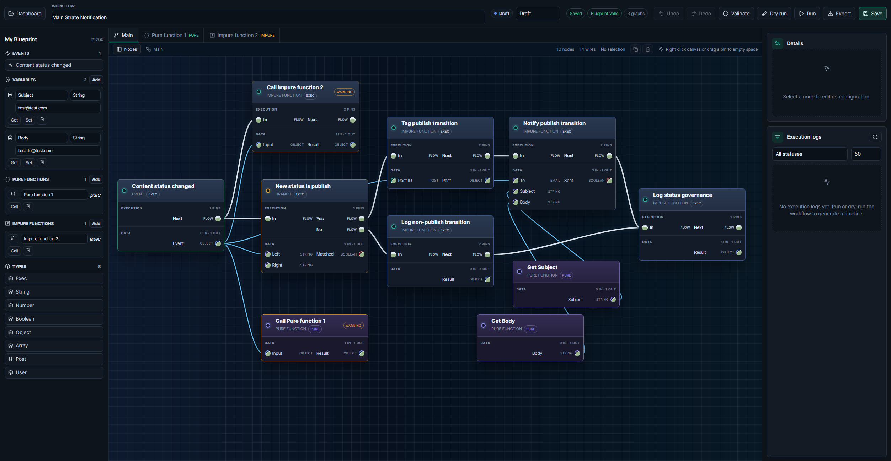

# WP Executor

> **The open-source remote execution agent for the ProjectFlash workflow platform.** A single-binary worker, written in Rust, that performs the host-side operations a workflow requires — system commands, file IO, outbound HTTP — on infrastructure you control.

[](#license)

`wp-executor` is the open-source companion of the ProjectFlash commercial workflow platform. The platform models the *intent* of an automation; this binary executes that intent's host-side actions — shell commands, file system operations, outbound network calls — on hardware you operate, under a capability allowlist you define.

This repository contains the executor binary and install scripts for Linux, macOS and Windows.

---

## Where this fits

<p align="center">
  
</p>

The platform is where customers compose automations. When a step requires an action that should not run inside the WordPress request lifecycle — repository synchronisation, media transcoding, scheduled backups, or any operation that benefits from a separate execution boundary — the platform records the intent. `wp-executor` polls for that intent on its own cadence, evaluates it against a local capability allowlist, executes it, and returns a structured result. Authentication is bearer-token, optionally augmented with HMAC body signing.

The wire protocol and queue semantics are not enumerated here: the platform publishes its versioned contract over a public REST surface, and the executor consumes it on startup as the source of truth.

### What it shows

|  |  |
|:---:|:---:|
| **The workflow library.** A unified inventory of every automation defined for a site, with execution state and structural metrics surfaced at a glance. | **The visual workflow editor.** Triggers, conditional branches, function invocations and error boundaries are first-class graph elements. The canvas is the production surface, not a sketch. |

The screenshots are taken from WP-PFWorkflow, the upstream commercial product — see [Related products](#related-products). They are included here so the role of the executor is unambiguous: the platform composes and dispatches a workflow; the executor performs the host-side work that workflow requires.

---

## Capabilities

The executor implements exactly the six capabilities the platform's contract defines, no more, no less. Each one carries a typed payload and returns a typed result.

| Key | What it does | Typical use |
|---|---|---|
| `shell.run` | Execute a shell command (cmd / powershell / pwsh / bash / sh / auto) with hard timeout, optional stdin, environment overrides, working directory | Run scripts, scheduled maintenance, build pipelines, anything you'd put in `cron` |
| `fs.read` | Read a file as utf-8 or base64, with a max-bytes guard and best-effort MIME detection | Hand a config file, a log fragment or a generated artifact back to the workflow |
| `fs.write` | Write a file (overwrite / append / create-only), auto-create parent directories, base64 input ok | Drop a generated report, save a downloaded asset, stage a file before another step picks it up |
| `fs.list` | Directory listing, optional recursive, hidden filter, max-entries cap | Inventory a release directory, drive a per-file loop in the workflow |
| `http.request` | Arbitrary HTTP call (any method, any headers, JSON or string body) with timeout. Status code is surfaced as the exit code | Hit a LAN-only API, call a self-hosted service, fetch from a private host the WordPress server cannot reach |
| `system.info` | OS, arch, hostname, CPU count, memory, executor version, uptime, capabilities advertised | Health checks, populating workflow metadata, fleet inventory |

Every capability accepts an executor-side timeout, refuses to perform operations outside the configured allowlist, and returns a uniform `{ exit_code, stdout, stderr, output, duration_ms, error }` payload.

---

## Install

### Pre-built binaries

Each tagged release publishes binaries for Linux (x86_64), macOS (x86_64 + Apple Silicon) and Windows (x86_64). Download the archive that matches your platform from the [releases page](https://github.com/Project-Flash-Build/wp-executor/releases), unzip, and place the `wp-executor` binary somewhere on your `PATH`.

### Build from source

```bash
cargo build --release
# binary at target/release/wp-executor
```

Requires Rust 1.80 or newer. No system dependencies (TLS uses `rustls`).

### Run as a service

Install scripts are shipped under [`scripts/`](scripts/). They write a service definition appropriate for the platform and start the worker.

| Platform | Command |
|---|---|
| Linux (systemd) | `sudo ./scripts/install-linux.sh` (system) or `./scripts/install-linux.sh --user` |
| macOS (launchd) | `./scripts/install-macos.sh` (per-user) or `sudo ./scripts/install-macos.sh --system` |
| Windows (sc.exe) | Run elevated PowerShell: `.\scripts\install-windows.ps1` |

Each installer creates a config template if one does not exist; the worker will refuse to start until you fill in `base_url` and `bearer_token`. Matching `uninstall-*` scripts are provided.

---

## Configuration

The executor reads a TOML file from the platform's user config directory:

| Platform | Default path |
|---|---|
| Linux | `~/.config/wp-executor/config.toml` |
| macOS | `~/Library/Application Support/wp-executor/config.toml` |
| Windows | `%APPDATA%\wp-executor\config.toml` |

Override with `--config /path/to/config.toml` or `WP_EXECUTOR_CONFIG=/path`.

Minimum config:

```toml
base_url     = "https://your-wordpress-site.example.com"
bearer_token = "pfw_worker_<id>_<secret>"
```

The full set of tunables (poll interval, lease duration, allowlist, signing toggle, etc.) is documented in [`scripts/config.example.toml`](scripts/config.example.toml).

The bearer token is provisioned for each worker through the WP-PFWorkflow administration surface; it is shown in plain text exactly once and can be rotated at any time. The executor never writes the secret to disk beyond the config file and never emits it in log output.

---

## CLI

```text
USAGE:
    wp-executor [OPTIONS] <COMMAND>

COMMANDS:
    run            Start the worker loop until SIGINT / SIGTERM / Ctrl+C
    probe          One-shot connectivity check against the upstream contract endpoint
    show-config    Print the resolved configuration with the token redacted
    system-info    Print the local system.info payload (no upstream call)
    capabilities   List the capabilities this binary implements
```

Quick health check before installing as a service:

```bash
wp-executor --base-url=https://your-site.tld --token=pfw_worker_1_xxx probe
```

A successful probe prints the upstream contract document and exits zero.

---

## Security model

- All upstream calls authenticate with a worker-specific bearer token and (by default) carry an `X-PFW-Signature` HMAC-SHA256 of the request body. Disable the second factor only if you understand the trade-off.
- Capabilities run with the privileges of the user the executor process runs as. Install as a dedicated low-privilege user where possible (the Linux installer does this by default).
- The executor never writes secrets to disk beyond the config file, and redacts the bearer token in `show-config` output.
- TLS is provided by `rustls`; OpenSSL is not a dependency. Rotating the system trust store is sufficient to update the executor's trust anchors.
- Capability allowlist (`allowed_capabilities` in config) is enforced *before* execution. The platform also enforces a per-worker allowlist server-side; both must agree for a job to run.

---

## Related products

`wp-executor` is the open-source surface of a three-product portfolio from Project Flash Build:

| Component | Status |
|---|---|
| <br/>**wp-executor** (this repository) | **Open source.** Released under MIT OR Apache-2.0. |
| <br/>**WP-PFWorkflow** | The commercial visual workflow platform shown in the screenshots above. Proprietary WordPress plugin, licensed per customer. **Launching in 2026.** |
| <br/>**WP-PFAgent** | The commercial AI agent layer that drives the workflow platform from natural language. Proprietary WordPress plugin, licensed per customer. **Launching in 2026.** |
| <br/>**WP-PFManagement** | The commercial structured-data layer (entities, fields, forms, lists, business rules) that the platform builds apps on top of. Proprietary WordPress plugin, licensed per customer. **Launching in 2026.** |

WP-PFWorkflow, WP-PFAgent and WP-PFManagement are **proprietary, per-customer-licensed WordPress plugins**, distributed independently of this repository's permissive licence. They will be available for evaluation, purchase and licensing through the Project Flash product portal at [project-flash.com](https://project-flash.com) when the launch window opens.

The executor is fully functional on its own against the platform's published REST contract; no commercial licence is required to operate `wp-executor` itself — only to license the platform on the WordPress side.

---

## Development

```bash
cargo fmt --all
cargo clippy --all-targets --all-features -- -D warnings
cargo test --all-targets
```

The unit and integration suites cover Linux, macOS and Windows. Integration tests in `tests/worker_loop.rs` use [`wiremock`](https://crates.io/crates/wiremock) to stand in for the upstream REST surface, so they do not require a running WordPress instance.

---

## License

Dual-licensed under either of:

- Apache License, Version 2.0
- MIT license

at your option. SPDX: `MIT OR Apache-2.0`.

The screenshots under `assets/` are © Project Flash Build and depict the commercial WP-PFWorkflow product. They are redistributed within this repository under the same dual licence as the source.

---

© 2026 Project Flash Build. The ProjectFlash name and logo are trademarks of Project Flash Build.
